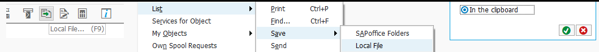
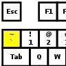

# SAPGUI Export
An AutoHotkey script used to extract the data in different NetWeaver screens in a single key press.

Because AutoHotkey is used, there is no dependency on the NW system paramter `sapgui/user_scripting` and will work in any system.

## Getting Started

### Prerequisites

Install AutoHotkey : https://www.autohotkey.com/

And change SAP Logon/SAPGUI to a supported theme. Because we don't rely on the COM we have to pixel hunt for certain buttons and the theme determines the visual appearance of a button.

Supported SAPGUI themes:

* Blue Crystal Theme
* SAP Signature Theme

### Installing

[Download the repository](https://bitbucket.org/jenjen1002/sapgui_export/downloads/) and extract to any location.

### Starting

Double-click the `sapgui_export.ahk` file and you will see the AutoHotkey icon  appear in the System Tray.

(It is best to start the script as Administrator (right click -> Run as Administrator). See why below in *Additional Notes*.)

### Using

To run the script, tap the tilde/backtick key ( \` ) with an SAPGUI screen in focus and when the key lifts the script will execute and determine the method needed to save the data on that screen.

If you wish to export the contents of an ALVGrid, click the ALVGrid first to put it in focus then tap tilde/backtick.

## Additional Notes

The script will "take over" and relocate your mouse cursor in some situations. This is unfortunately required for some screens due to the design of SAPGUI. In these scenarios I need to actually move the mouse for the click to register in the correct position. I try to avoid this where possible and where I can't avoid this I will try and put the mouse back where I found it ;)

Running as Administrator. There are small delays (~10 ms) between each key press & click. In order to improve the reliability of the script, I block all user input while moving the mouse for clicks and unblock once the mouse is back in its original position. Blocking does not work unless the script is running as Administrator.

The hotkey which activates the script can only be customized by editing the `sapgui_export.ahk` file directly. It is done so at the `` Up::` line. See the [AutoHotkey KeyList](https://autohotkey.com/docs/KeyList.htm) for possible key combinations are possible.